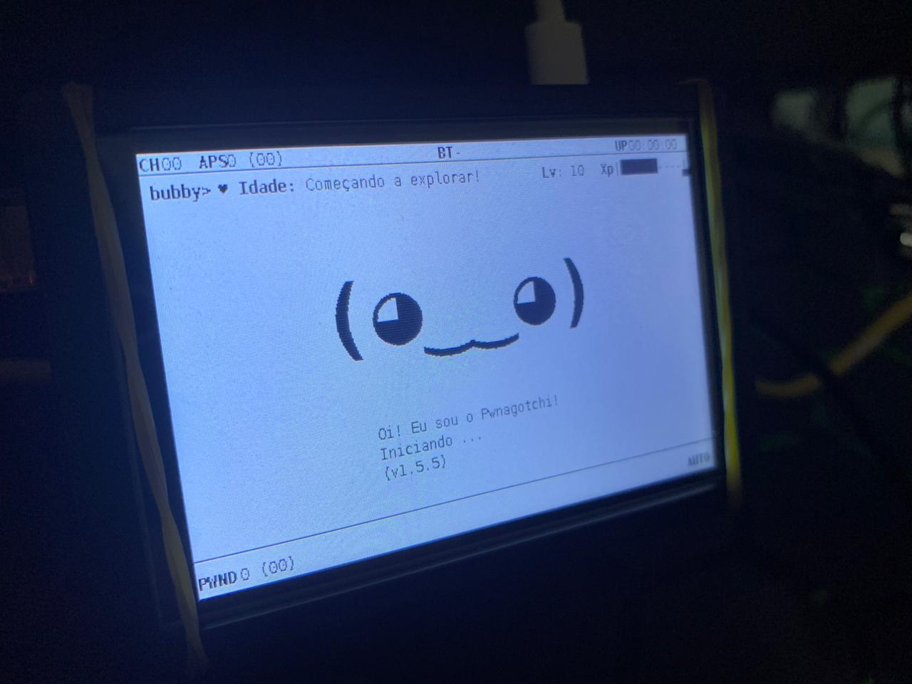

# Pwnagotchi 3.5" TFT Plugin
Este repositório contém plugins e arquivos de configuração para otimizar o uso do Pwnagotchi em uma tela TFT de 3,5 polegadas, rodando em uma Raspberry Pi 3B+. Ele inclui ajustes na interface, melhorias nos plugins de idade (Age Plugin) e experiência (EXP Plugin), além de suporte a múltiplos idiomas.

## Funcionalidades:
Suporte à Localização (i18n)
O projeto inclui suporte a diferentes idiomas através de arquivos .po e .mo. Atualmente, o português do Brasil já está disponível, e você pode adicionar novos idiomas seguindo os passos descritos na documentação.

### Atualizações no Age Plugin
Exibe "Começando a explorar!" para Pwnagotchis recém-criados ou com idade negativa.
Logs detalhados de depuração, com a opção de ativar/desativar através da variável ENABLE_LOGGING.
### Melhorias no EXP Plugin
Barra de progresso de experiência (EXP) mais clara e interativa, com símbolos visuais que facilitam o acompanhamento.
Expressões faciais dinâmicas baseadas no progresso de EXP.
Exibição de nível e EXP de forma otimizada para pequenas telas.
### Personalização:
Todos os parâmetros de interface, como a barra de progresso e a exibição de nível, podem ser ajustados no arquivo config.yml para diferentes tamanhos de tela.

### Guia de Instalação e Configuração:
Para garantir que o Pwnagotchi funcione corretamente com a tela TFT de 3,5 polegadas, é necessário seguir alguns passos adicionais de configuração. Estes incluem:

Habilitar o login de root via SSH para facilitar o acesso e controle.
Ajustar as configurações da tela no arquivo config.toml e adaptar o arquivo spotpear24inch.py às especificidades do seu dispositivo.
Ativar a tela com o script da Waveshare, utilizando o comando LCD35-show para garantir que a interface gráfica seja exibida corretamente na tela de 3,5 polegadas.
Esses passos são descritos em detalhes no arquivo de instalação. Consulte o arquivo [INSTALL.md](https://github.com/sposito88/pwnagotchi_3.5_TFT/blob/main/INSTALL.md) para o passo a passo completo de instalação e configuração.

### Versão do Pwnagotchi:
Baseado na versão v1.5.5 do Pwnagotchi.

